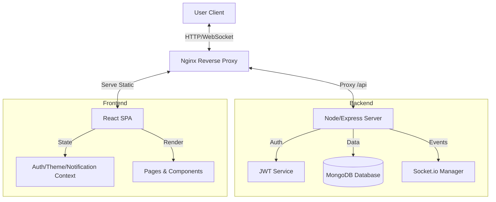
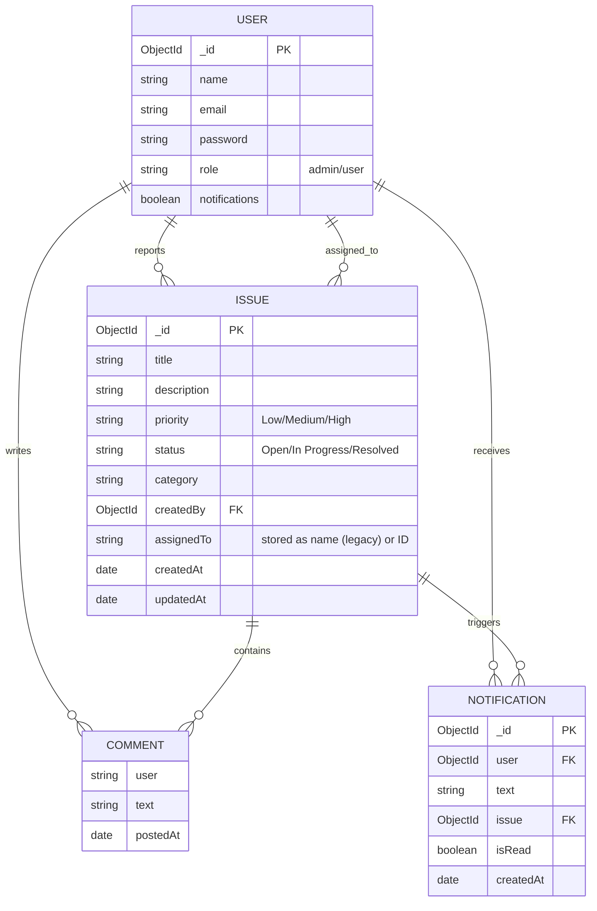

# Architecture & Design Document

## 1. Technology Stack & Justification

We selected the **MERN Stack** (MongoDB, Express.js, React, Node.js) for the Digital Issue Tracking Dashboard.

-   **MongoDB (Database)**: A NoSQL database that offers flexibility for evolving data schemas (issues, comments, notifications). Its document-oriented structure maps directly to JSON, simplifying the data flow.
-   **Express.js (Backend Framework)**: A minimal and flexible Node.js web application framework that provides a robust set of features for web and mobile applications. It simplifies API creation and middleware management.
-   **React (Frontend Library)**: Facilitates the creation of interactive UIs with reusable components (Kanban Board, Issue Cards). Its Virtual DOM ensures high performance, and the ecosystem (Vite, Tailwind) accelerates development.
-   **Node.js (Runtime)**: Allows using JavaScript on both client and server, unifying the language stack and enabling high concurrency via its event-driven, non-blocking I/O model.
-   **Socket.io (Real-Time)**: Chosen over polling for its low-latency, bi-directional communication capabilities, essential for the live Kanban board and instant notifications.

### System Flow Diagram

## 2. Database Schema & Entity Design

### ER Diagram

## 3. Deployment Architecture

The application is containerized using **Docker**.
-   **Client Container**: Builds the React app and serves it via Nginx.
-   **Server Container**: Runs the Node.js API.
-   **Docker Compose**: Orchestrates the services, including the MongoDB instance (or connection to cloud Atlas).
