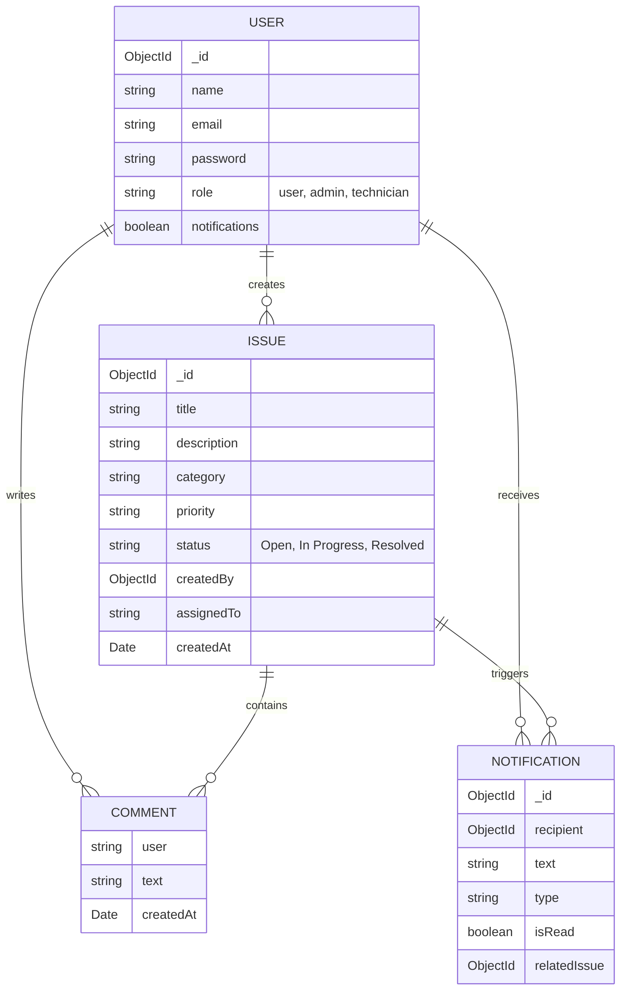
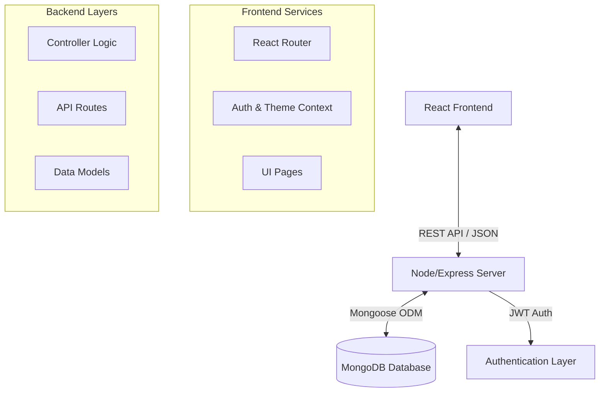

# Software Requirements Specification (SRS)
## Digital Issue Tracking Dashboard

**Version:** 1.1
**Date:** 2026-02-03
**Status:** Draft

---

### Table of Contents
1. [Introduction](#1-introduction)
2. [Overall Description](#2-overall-description)
3. [System Features (Use Cases)](#3-system-features-use-cases)
4. [Data Model & Database Design](#4-data-model--database-design)
5. [System Architecture](#5-system-architecture)
6. [Non-Functional Requirements](#6-non-functional-requirements)
7. [External Interface Requirements](#7-external-interface-requirements)
8. [Appendix A: API Reference](#8-appendix-a-api-reference)

---

### 1. Introduction
#### 1.1 Purpose
The purpose of this document is to define the comprehensive software requirements for the Digital Issue Tracking Dashboard (DITD). This web-based application is designed to streamline the reporting, tracking, and resolution of organizational issues, providing transparency and accountability.

#### 1.2 Scope
The DITD system provides a centralized platform for:
*   **Users** to report technical, infrastructural, or academic issues.
*   **Technicians** to receive, view, and resolve assigned tasks.
*   **Administrators** to oversee the entire lifecycle of issues, manage user roles, and analyze system performance via dashboards.

#### 1.3 Definitions, Acronyms, and Abbreviations
| Term | Definition |
|:--- |:--- |
| **DITD** | Digital Issue Tracking Dashboard |
| **RBAC** | Role-Based Access Control |
| **JWT** | JSON Web Token, used for secure authentication |
| **MERN** | MongoDB, Express, React, Node.js (Stack) |
| **Ticket/Issue** | A single unit of work or problem reported by a user |
| **Technician** | A user with elevated privileges to view and close assigned issues |

---

### 2. Overall Description
#### 2.1 Product Perspective
The product is a standalone web application. It consists of a React frontend client and a Node.js/Express REST API backend, connecting to a MongoDB database.

#### 2.2 User Requirements (Roles)
*   **End User**: Can create issues, view status of own issues, and comment on them.
*   **Technician**: Can view issues assigned to them, update status (Open -> In Progress -> Resolved), and add technical comments.
*   **Administrator**: System super-user. Can view all issues, re-assign tickets, manage user accounts (promote/demote), and access analytics.

#### 2.3 Assumptions and Dependencies
*   Users must have a modern web browser (Edge, Chrome, Firefox, Safari).
*   The system requires an active internet connection to access the deployed server.
*   User email addresses are unique identifiers.

---

### 3. System Features (Use Cases)

#### 3.1 Authentication
**UC-01: User Registration**
*   **Actor**: Guest
*   **Precondition**: None
*   **Flow**: User enters Name, Email, Password. System creates account with default 'User' role.
*   **Postcondition**: User account created and logged in.

**UC-02: User Login**
*   **Actor**: Registered User
*   **Flow**: User enters Email, Password. System validates credentials and issues JWT.

#### 3.2 Issue Management
**UC-03: Create Issue**
*   **Actor**: User
*   **Description**: Report a new problem.
*   **Data Required**: Title, Description, Category (Bug/Infrastructure/Academic/Other), Priority (Low/Med/High).
*   **Postcondition**: Issue saved with status 'Open'.

**UC-04: View Issue Details**
*   **Actor**: User, Technician, Admin
*   **Description**: View full thread of an issue.
*   **Flow**: System displays metadata (status, priority) and comment history.

**UC-05: Update Issue Status**
*   **Actor**: Admin, Assigned Technician
*   **Precondition**: Issue is assigned to actor (or actor is Admin).
*   **Flow**: Actor changes status (e.g., from 'Open' to 'Resolved').
*   **System Action**: Triggers notification to the Issue Creator.

#### 3.3 System Administration
**UC-06: Assign Technician**
*   **Actor**: Admin
*   **Description**: Delegate an issue to a specific staff member.
*   **System Action**: Updates `assignedTo` field; sends notification to Technician.

**UC-07: Manage Users**
*   **Actor**: Admin
*   **Description**: View list of users; specific actions include viewing roles and deleting accounts.

---

### 4. Data Model & Database Design

#### 4.1 Entity Relationship Diagram (ERD)

---

### 5. System Architecture

#### 5.1 High-Level Architecture
The system follows a typical MVC (Model-View-Controller) pattern adapted for a decoupled Client-Server architecture.

---

### 6. Non-Functional Requirements
#### 6.1 Security
1.  **Password Hashing**: All passwords must be hashed using `bcrypt` before storage.
2.  **API Security**: All protected routes require a valid Bearer Token (JWT) in the header.
3.  **Data Validation**: Backend must validate all inputs to prevent injection attacks (handled via Mongoose schemas).

#### 6.2 Reliability & Availability
1.  **Uptime**: Service availability target is 99.9% during business hours.
2.  **Error Handling**: The system should gracefully handle 404 and 500 errors with user-friendly messages (e.g., "Issue not found" rather than a white screen).

#### 6.3 Performance
1.  **Response Time**: API response time should be < 500ms for standard requests.
2.  **Scalability**: Database indexing should be used on foreign keys (`createdBy`) for faster lookups.

#### 6.4 Usability
1.  **Responsive Design**: The application must be usable on mobile devices (375px width) and desktops (1920px width).
2.  **Accessibility**: Color contrast should meet WCAG AA standards; notification icons should use distinct colors (Red/Green/Blue) for easy recognition.

---

### 7. External Interface Requirements
#### 7.1 User Interfaces
*   **Theme**: Support for Light, Dark, and Midnight themes.
*   **Navigation**: Sidebar navigation for desktop, drawer menu for mobile.
*   **Notifications**: Toast messages for immediate feedback (Success/Error).

#### 7.2 Software Interfaces
*   **Database**: MongoDB v4.4+.
*   **Runtime**: Node.js v14+.

---

### 8. Appendix A: API Reference
| Method | Endpoint | Description | Access |
|:--- |:--- |:--- |:--- |
| **POST** | `/api/auth/login` | Authenticate & Get Token | Public |
| **GET** | `/api/issues` | Get all tickets | Admin |
| **POST** | `/api/issues` | Create new ticket | Private |
| **PUT** | `/api/issues/:id/status` | Update ticket status | Admin/Tech |
| **PUT** | `/api/issues/:id/assign` | Assign ticket | Admin |
| **POST** | `/api/issues/:id/comment`| Add comment | Private |
| **GET** | `/api/notifications` | Get user notifications | Private |
